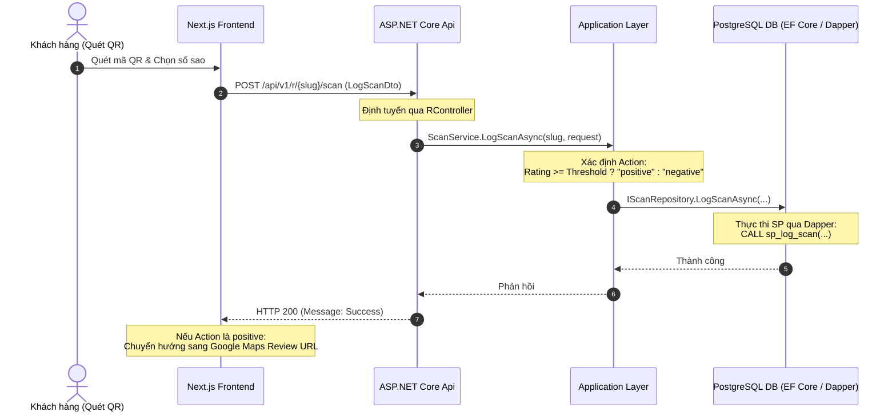

# PROJECT_CONTEXT.md - ReviewLoom System Context

Tài liệu này cung cấp cái nhìn toàn diện và chính xác nhất về hiện trạng kiến trúc, công nghệ, database, các quy tắc nghiệp vụ và nợ kỹ thuật của dự án **ReviewLoom** dựa trên việc phân tích mã nguồn thực tế.

---

## 1. Tổng quan hệ thống

*   **Tên dự án:** ReviewLoom
*   **Mục tiêu nghiệp vụ:** Nền tảng SaaS giúp các doanh nghiệp địa phương tối ưu hóa quy trình thu thập phản hồi và nâng cao xếp hạng đánh giá trên Google Maps. Hệ thống cho phép:
    *   Tạo mã QR tùy chỉnh cho từng chiến dịch.
    *   Điều hướng khách hàng thông minh (Smart Feedback Routing): Đánh giá tốt (tích cực) chuyển hướng sang Google Maps để đăng công khai; đánh giá chưa tốt (tiêu cực) được giữ lại qua Form riêng tư để gửi trực tiếp cho chủ cửa hàng cải thiện, giảm thiểu review xấu công khai.
    *   Thiết kế và xuất bản bộ công cụ marketing Standee để bàn chất lượng cao chuẩn in ấn.
*   **Đối tượng người dùng:** Chủ doanh nghiệp địa phương (như nhà hàng, quán cafe, spa, tiệm làm móng, phòng khám nha khoa, khách sạn...).
*   **Các module chính:**
    1.  **Module Chiến dịch & QR Code (Campaign & QR Code Module):** Quản lý cấu hình thương hiệu, giao diện Landing Page, và tạo mã QR động.
    2.  **Module Điều hướng phản hồi (Feedback Routing Module):** Nhận đánh giá sao của khách hàng và tự động phân loại chuyển hướng.
    3.  **Module Thiết kế Standee (Standee Designer Module):** Trình biên tập mẫu Standee trực quan và xuất file PNG 300 DPI chuẩn in ấn.
    4.  **Module Thống kê (Analytics Module):** Theo dõi số lượng quét mã QR, tỷ lệ chuyển đổi review tốt/xấu.
    5.  **Module Thanh toán (Billing & Subscriptions Module):** Tích hợp Stripe để đăng ký gói Pro và quản lý trạng thái thanh toán.
    6.  **Module Đồng bộ Tài khoản (User Synchronization Module):** Đồng bộ tài khoản người dùng từ hệ thống định danh Clerk qua Webhooks.

---

## 2. Kiến trúc hệ thống

Dự án áp dụng mô hình **Clean Architecture** (Onion Architecture) chia làm 4 tầng riêng biệt ở Backend và ứng dụng Next.js ở Frontend:

### Sơ đồ luồng Request (Request Lifecycle)


### Các tầng kiến trúc (Cơ cấu Backend):
*   **ReviewLoom.Domain:** Tầng trung tâm chứa các Entity cốt lõi (`User`, `Campaign`, `Scan`, `Subscription`, `CampaignStyle`, `CampaignSettings`, `CampaignStandeeConfig`, `StandeeTemplate`), các Enum (`CampaignStatus`) và các Interface định nghĩa Repository (`IRepository`, `ICampaignRepository`, `IScanRepository`, `IUserRepository`, `IStandeeTemplateRepository`, `IStatsRepository`, `IUnitOfWork`).
*   **ReviewLoom.Application:** Chứa các logic nghiệp vụ (Services: `CampaignService`, `ScanService`, `StatsService`, `UserService`), định nghĩa DTOs (`CampaignDto`, `CreateCampaignDto`, `LogScanDto`, `CampaignStatsDto`, `PublicCampaignDto`, `ScanResultDto`) và các extension method mapping giữa Entity và DTO (`CampaignMappingExtensions.cs`).
*   **ReviewLoom.Infrastructure:** Chi tiết triển khai kỹ thuật bao gồm EF Core DbContext (`ReviewLoomDbContext`), các lớp Repository cụ thể tương tác DB (`Repository`, `CampaignRepository`, `ScanRepository`, `UserRepository`, `StatsRepository`, `UnitOfWork`), và các tích hợp dịch vụ bên ngoài (`StripeService`, `CloudinaryMediaService`).
*   **ReviewLoom.Api:** Điểm đầu vào ứng dụng REST API, các Controller (`CampaignsController`, `RController`, `MediaController`, `BillingController`, `ClerkWebhookController`) và cấu hình middleware, Authentication/Authorization trong `Program.cs`.

> [!IMPORTANT]
> **Quy tắc Kiến trúc bắt buộc (Architectural Layering Rule)**:
> Để duy trì tính độc lập giữa các tầng, **API Controllers tuyệt đối KHÔNG ĐƯỢC PHÉP inject trực tiếp `IUnitOfWork` hoặc bất kỳ Repository nào**. Mọi truy cập dữ liệu và kiểm tra logic nghiệp vụ phải đi qua Application Services. Xem chi tiết tại [Clean Architecture Rules](file:///home/ducdat/IT/CNPM/LT-Web-ASP.Net-Core/reviewloom/docs/architecture/clean_architecture_rules.md).

### Các Design Pattern sử dụng:
1.  **Repository & Unit of Work Pattern:** Che giấu chi tiết của EF Core DbContext khỏi tầng nghiệp vụ, quản lý giao dịch tập trung (`IUnitOfWork.CompleteAsync()`).
2.  **Hybrid Data Access Pattern:**
    *   **Entity Framework Core:** Dùng cho thao tác CRUD thông thường có quan hệ phức tạp và cần tracking trạng thái (Campaign, Settings, Styles).
    *   **Dapper:** Dùng để gọi Stored Procedures (`sp_log_scan`) và Database Functions (`fn_get_campaign_stats`) cho các tác vụ cần hiệu năng cao và ghi nhận dữ liệu nhanh.
3.  **Data Transfer Object (DTO) Pattern:** Tách biệt hoàn toàn tầng API và tầng Domain để bảo mật cấu trúc cơ sở dữ liệu.
4.  **Dependency Injection:** Đăng ký tự động vòng đời dịch vụ thông qua Service Collection (`AddApplicationServices` & `AddInfrastructureServices`).

---

## 3. Công nghệ sử dụng

### Frontend:
*   **Framework:** Next.js 15 (App Router, React 19).
*   **UI Library:** Tailwind CSS (áp dụng phong cách *Modern Glassmorphism & Structural Silence*). Biểu tượng sử dụng Google Material Symbols Icons.
*   **State Management:** React Hooks (`useState`, `useEffect`, `useRef`), Clerk SDK cho Context tài khoản.
*   **Routing:** Next.js App Router (sử dụng dynamic segment `r/[slug]` cho trang quét và `dashboard/` cho trang quản trị).
*   **Build Tool:** npm.

### Backend:
*   **Framework:** .NET 8.0 / ASP.NET Core Web API.
*   **ORM:** Entity Framework Core (PostgreSQL Provider) kết hợp Dapper.
*   **CQRS:** Chưa sử dụng (Hệ thống dùng Service-based pattern truyền thống).
*   **Authentication:** Clerk JWT Bearer Authentication (tích hợp qua `AddJwtBearer` và `Clerk:Authority` config).
*   **Caching:** Chưa xác định (Không có code caching trong hệ thống hiện tại).
*   **Background Jobs:** Hàng đợi bất đồng bộ trong bộ nhớ (`System.Threading.Channels` + `IHostedService`) dùng để gửi email phản hồi phản hồi (feedback reply) qua SMTP mà không chặn API.

### Database:
*   **DBMS:** PostgreSQL.
*   **Các Migration hiện có:**
    1.  `20260503080253_AddNormalizedCampaignTables`: Tạo cấu trúc chuẩn hóa cho các bảng Style, Settings liên kết 1:1 với Campaign.
    2.  `20260503135722_AddIsActiveToCampaign`: Thêm trường `IsActive` cho chiến dịch.
    3.  `20260503143507_UpdateGetCampaignStatsFunction`: Định nghĩa hàm `fn_get_campaign_stats` tính toán số lượt quét.
    4.  `20260507033932_AddCampaignStatus`: Thêm trường `Status` (Draft/Published/Archived) cho Campaign.
    5.  `20260507092044_RemoveIsActiveFromCampaign`: Loại bỏ trường `IsActive` khỏi Campaign để sử dụng hoàn toàn trường `Status`.
    6.  `20260516110840_AddRatingToScan`: Thêm cột `Rating` vào bảng `scans`.
    7.  `20260516120231_UpdateSpLogScanWithRating`: Cập nhật Stored Procedure `sp_log_scan` để nhận diện và lưu thêm giá trị đánh giá (Rating).

### Infrastructure & External Services:
*   **Docker:** Chưa xác định (Không có Dockerfile trong thư mục dự án).
*   **CI/CD:** Chưa xác định.
*   **External Integrations:**
    *   **Clerk:** Định danh người dùng. Xác thực JWT từ API Client và nhận Webhooks đồng bộ user (`Svix` signatures verification).
    *   **Stripe:** Cổng thanh toán quốc tế và quản lý gói đăng ký định kỳ.
    *   **Cloudinary:** CDN lưu trữ và tối ưu hóa logo doanh nghiệp tải lên (`reviewloom/logos`).

---

## 4. Cấu trúc thư mục

```text
reviewloom/
├── backend/                             # Giải pháp backend ASP.NET Core
│   ├── src/                             # Mã nguồn chạy ứng dụng (Production Code)
│   │   ├── ReviewLoom.Domain/           # Tầng nghiệp vụ trung tâm (Entities, Enums, Interfaces)
│   │   │   ├── Entities/                # Các Domain Model chính (Campaign, User, Scan, Subscription...)
│   │   │   └── Interfaces/              # Các giao diện hợp đồng Repository (IUnitOfWork, IRepository...)
│   │   ├── ReviewLoom.Application/      # Tầng nghiệp vụ chính (Services, DTOs, Mappings)
│   │   │   ├── Services/                # Triển khai Service chính (CampaignService, ScanService...)
│   │   │   └── Mappings/                # Chứa logic chuyển đổi Entity <-> DTO
│   │   ├── ReviewLoom.Infrastructure/   # Chi tiết cơ sở dữ liệu và API bên thứ ba (Stripe, Cloudinary)
│   │   │   ├── Data/                    # DbContext & EF Core Migrations
│   │   │   ├── Repositories/            # Cài đặt cụ thể cho các Repo (EF Core + Dapper)
│   │   │   └── Services/                # Integrations (Stripe, Cloudinary)
│   │   └── ReviewLoom.Api/              # REST API Host
│   │       ├── Controllers/             # API Controllers (CampaignsController, RController...)
│   │       └── Program.cs               # Cấu hình Host, Middleware Pipeline
│   ├── tests/                           # Thư mục chứa các dự án Test
│   │   └── ReviewLoom.Infrastructure.Tests/ # Các test case cho tầng Infrastructure
│   └── database/                        # Thư mục lưu schema.sql khởi tạo cơ sở dữ liệu gốc
├── frontend/                            # Mã nguồn ứng dụng Next.js
│   ├── app/                             # Các route của Next.js (App Router)
│   │   ├── r/[slug]/                    # Landing page thu thập ý kiến khách hàng (Public)
│   │   └── dashboard/                   # Bảng điều khiển quản trị của chủ doanh nghiệp
│   │       ├── campaigns/               # Quản lý & thiết kế chiến dịch ([id])
│   │       ├── inbox/                   # Hộp thư xem góp ý tiêu cực
│   │       └── settings/                # Cài đặt tài khoản
│   ├── components/                      # UI Component dùng chung (ui, campaign, layout)
│   ├── services/                        # Gọi API sang Backend (campaign-service.ts, scan-service.ts...)
│   └── lib/                             # Axios/Fetch client base config
└── docs/                                # Tài liệu đặc tả hệ thống
    ├── architecture/                    # Tài liệu kiến trúc & quy tắc Clean Architecture (Mới)
    ├── dashboard_context.md             # Tài liệu chi tiết module Dashboard & Inbox
    └── frontend_context.md              # Tài liệu chi tiết cấu trúc & kiến trúc Next.js Frontend
```

---

## 5. Domain Model (Các thực thể chính)

Tất cả thực thể được định nghĩa trong thư mục [backend/src/ReviewLoom.Domain/Entities](file:///home/ducdat/IT/CNPM/LT-Web-ASP.Net-Core/reviewloom/backend/src/ReviewLoom.Domain/Entities):

1.  **User (`User.cs`):** Đại diện cho chủ cửa hàng đăng ký tài khoản trên hệ thống.
    *   *Mối quan hệ:*
        *   Một User sở hữu nhiều `Campaign` (1:N).
        *   Một User sở hữu nhiều `Subscription` (1:N).
2.  **Campaign (`Campaign.cs`):** Đại diện cho một chiến dịch QR thu thập phản hồi của cửa hàng.
    *   *Mối quan hệ:*
        *   Thuộc về một `User` (`UserId`).
        *   Chứa nhiều bản ghi lượt quét `Scan` (1:N).
        *   Liên kết 1:1 với `CampaignStyle` (Cấu hình hiển thị Landing Page & QR).
        *   Liên kết 1:1 with `CampaignSettings` (Cấu hình hành vi nghiệp vụ).
        *   Liên kết 1:1 với `CampaignStandeeConfig` (Cấu hình standee in ấn).
3.  **CampaignStyle (`CampaignStyle.cs`):** Chi tiết cấu hình hiển thị và thương hiệu của chiến dịch.
    *   *Cấu trúc:* `PrimaryColor`, `FontFamily`, `LogoStyle` (circle/square/soft/none), `RatingIconType` (stars/emoji/thumbs), `BackgroundStyle` (none/image/gradient), `BackgroundImage`, `BackgroundGradient`, `QrDotColor`, `QrFrame`.
4.  **CampaignSettings (`CampaignSettings.cs`):** Cấu hình các thiết lập hành vi thu thập thông tin và khuyến khích.
    *   *Cấu trúc:* `RoutingThreshold` (ngưỡng sao, giá trị 4 hoặc 5), `Heading`, `CtaLabel`, `ThankYouMessage`, `CollectContact` (bool - thu thập thông tin khách hàng), `IncentiveEnabled` (bool), `IncentiveCoupon` (mã giảm giá hiển thị sau khi khách hàng gửi feedback tiêu cực).
5.  **CampaignStandeeConfig (`CampaignStandeeConfig.cs`):** Cấu hình xuất file marketing standee in ấn.
    *   *Cấu trúc:* `TemplateId` (minimal_white/prestige_dark/salon_blush/cafe_kraft), `CtaText`, `ShowLogo` (bool).
6.  **Scan (`Scan.cs`):** Ghi nhận mỗi lần khách hàng tương tác (quét QR và gửi đánh giá).
    *   *Cấu trúc:* `Action` (lưu 'positive' hoặc 'negative'), `Rating` (số sao), `FeedbackName`, `FeedbackEmail`, `FeedbackMessage`, `ScannedAt`.
    *   *Mối quan hệ:* Thuộc về một `Campaign` (`CampaignId`).
7.  **Subscription (`Subscription.cs`):** Quản lý tình trạng thanh toán gói cước của User.
    *   *Cấu trúc:* `PaymentProvider` (stripe/paypal/lemonsqueezy), `ProviderCustomerId`, `ProviderSubscriptionId`, `PlanId` (pro_monthly/pro_yearly), `Status` (active/canceled/past_due/trialing), `CurrentPeriodEnd`, `CreatedAt`, `UpdatedAt`.

---

## 6. Các tính năng hiện có

Nhóm theo module thực tế tồn tại trong code:

### Module Đăng ký & Đồng bộ tài khoản (Authentication)
*   **Chức năng:** Tự động đồng bộ thông tin tài khoản người dùng từ Clerk sang DB của hệ thống khi đăng ký hoặc bị xóa thông qua Svix Webhook verification.
*   **Endpoint liên quan:** `POST /api/webhooks/clerk` (xử lý sự kiện `user.created` và `user.deleted`).
*   **Luồng xử lý:** Kiểm tra chữ ký Svix hợp lệ → Parse JSON lấy thông tin email chính, clerk_id, first_name → Kiểm tra xem user đã tồn tại chưa → Lưu mới vào DB với ID tự sinh (Guid).

### Module Quản lý Chiến dịch & QR Code (Campaigns)
*   **Chức năng:** Cho phép chủ cửa hàng tạo mới, chỉnh sửa, hiển thị danh sách chiến dịch và xóa chiến dịch.
*   **Endpoint liên quan:**
    *   `GET /api/v1/Campaigns` (Lấy danh sách các chiến dịch của user hiện tại).
    *   `GET /api/v1/Campaigns/{id}` (Lấy chi tiết chiến dịch bao gồm cả Style, Settings, Standee).
    *   `POST /api/v1/Campaigns` (Tạo mới chiến dịch kèm cấu hình Style và Settings mặc định).
    *   `PUT /api/v1/Campaigns/{id}` (Cập nhật toàn bộ các cấu hình style, settings, standee).
    *   `DELETE /api/v1/Campaigns/{id}` (Xóa chiến dịch).
*   **Luồng xử lý:** Lấy Clerk User ID từ JWT token → Tra cứu Guid user trong DB → Thực hiện thao tác CRUD thông qua Repository và lưu dữ liệu bằng Unit of Work. Khi tạo mới, slug chiến dịch được tạo tự động bằng tên doanh nghiệp chuyển đổi thường, gạch ngang và thêm 6 ký tự ngẫu nhiên.

### Module Điều hướng Đánh giá thông minh (Feedback Routing)
*   **Chức năng:** Nhận đánh giá sao của khách hàng từ Landing Page và điều hướng sang Google Maps hoặc Form góp ý riêng tư.
*   **Endpoint liên quan:**
    *   `GET /api/v1/r/{slug}` (Lấy dữ liệu cấu hình công khai phục vụ render Landing Page).
    *   `POST /api/v1/r/{slug}/scan` (Ghi nhận thông tin scan và feedback).
*   **Luồng xử lý:**
    1.  Khách hàng chọn số sao trên giao diện Landing Page Next.js.
    2.  Hệ thống Next.js kiểm tra: Nếu số sao >= `RoutingThreshold` (ví dụ 4 sao) -> Ghi nhận `Action = positive` -> Gọi API ghi nhận Scan -> Chuyển hướng trình duyệt khách hàng sang Google Maps Review URL (`window.location.href = campaign.googleReviewUrl`).
    3.  Nếu số sao < `RoutingThreshold` -> Ghi nhận `Action = negative` -> Hiển thị form góp ý (Name, Email, Message) -> Khách hàng bấm gửi -> Gọi API ghi nhận Scan -> Hiển thị thông báo Cảm ơn nội bộ (và hiển thị mã giảm giá Coupon nếu có).

### Module Thiết kế Standee (Standee Designer)
*   **Chức năng:** Cho phép chủ cửa hàng thiết kế trực quan Standee in ấn (4x6 inch) từ danh mục 12 template mẫu mới thuộc 4 nhóm ngành hàng (Restaurant, Coffee Shop, Salon & Spa, Home Services) cộng với 4 template cổ điển. Danh mục được lưu trữ động ở backend database và tải qua API, phân biệt quyền sử dụng giữa tài khoản Free và Pro.
*   **Công nghệ frontend:** Sử dụng thư viện `html-to-image` để render một component HTML ẩn có kích thước 1200px (đại diện cho tỷ lệ 2:3) thành file PNG.

### Module Quản lý Media (Media & Logo Upload)
*   **Chức năng:** Upload logo doanh nghiệp lên máy chủ CDN Cloudinary.
*   **Endpoint liên quan:** `POST /api/v1/media/upload` (Public).
*   **Luồng xử lý:** Nhận file từ form-data → Kiểm tra file hợp lệ (chỉ cho phép JPG, JPEG, PNG, GIF, WEBP) → Gọi Cloudinary SDK tải lên thư mục `reviewloom/logos` với chất lượng tự động → Trả về secure URL.

---

## 7. Chi tiết API (API Summary)

| STT | Phương thức | Endpoint | Yêu cầu Auth | Request Pattern | Response Pattern |
|:---:| :--- | :--- | :--- | :--- | :--- |
| 1 | `POST` | `/api/webhooks/clerk` | Không | Svix Webhook Payload | HTTP 200 |
| 2 | `GET` | `/api/v1/r/{slug}` | Không | Tham số `slug` trên URL | `{ businessName, logoUrl, googleReviewUrl, style, settings }` |
| 3 | `POST` | `/api/v1/r/{slug}/scan` | Không | `LogScanDto` `{ rating, action, feedbackName, feedbackEmail, feedbackMessage }` | `{ Message: "Scan logged successfully" }` |
| 4 | `POST` | `/api/v1/media/upload` | Không | Form-data (file logo) | `{ url: "https://res.cloudinary.com/..." }` |
| 5 | `GET` | `/api/v1/Campaigns` | Có (Clerk JWT) | Không | `CampaignDto[]` |
| 6 | `GET` | `/api/v1/Campaigns/{id}` | Có (Clerk JWT) | Tham số `id` trên URL | `CampaignDto` |
| 7 | `POST` | `/api/v1/Campaigns` | Có (Clerk JWT) | `CreateCampaignDto` | `CampaignDto` (201 Created) |
| 8 | `PUT` | `/api/v1/Campaigns/{id}` | Có (Clerk JWT) | `UpdateCampaignDto` | `CampaignDto` |
| 9 | `DELETE` | `/api/v1/Campaigns/{id}` | Có (Clerk JWT) | Tham số `id` trên URL | HTTP 204 |
| 10 | `GET` | `/api/v1/Campaigns/{id}/stats` | Có (Clerk JWT) | Tham số `id` trên URL | `CampaignStatsDto` `{ totalScans, positiveScans, negativeScans }` |
| 11 | `POST` | `/api/v1/billing/create-checkout-session` | Có (Clerk JWT) | `{ planId }` | `{ Url: "https://checkout.stripe.com/..." }` |
| 12 | `POST` | `/api/v1/billing/webhook` | Không | Stripe Webhook Payload | HTTP 200 |
| 13 | `GET` | `/api/v1/dashboard/overview` | Có (Clerk JWT) | Không | `DashboardOverviewDto` |
| 14 | `GET` | `/api/v1/inbox` | Có (Clerk JWT) | Tham số lọc `campaignId`, `status`, `search` | `PrivateFeedbackDto[]` |
| 15 | `PUT` | `/api/v1/inbox/{id}/status` | Có (Clerk JWT) | `{ status }` | HTTP 204 |
| 16 | `POST` | `/api/v1/inbox/{id}/reply` | Có (Clerk JWT) | `{ replyMessage }` | HTTP 204 |
| 17 | `GET` | `/api/v1/billing/subscription` | Có (Clerk JWT) | Không | `SubscriptionOverviewDto` |

---

## 8. Chi tiết cơ sở dữ liệu (Database Summary)

Database được thiết kế theo cấu trúc chuẩn hóa cao cho các chiến dịch QR (PostgreSQL):

### Các bảng chính và mối quan hệ:
*   **users:** Khóa chính `id` UUID. Lưu trữ thông tin tài khoản đồng bộ từ Clerk qua trường `clerk_id` (Unique Index).
*   **campaigns:** Khóa chính `id` UUID. Chứa thông tin gốc của chiến dịch (slug, google_review_url, business_name, logo_url, thank_you_message, status).
*   **campaign_styles:** Khóa chính `campaign_id` (1:1 với `campaigns` ON DELETE CASCADE). Lưu trữ cấu hình màu sắc, kiểu dáng Landing Page và QR Code.
*   **campaign_settings:** Khóa chính `campaign_id` (1:1 với `campaigns` ON DELETE CASCADE). Cấu hình ngưỡng sao và coupon quà tặng.
*   **campaign_standee_configs:** Khóa chính `campaign_id` (1:1 với `campaigns` ON DELETE CASCADE). Cấu hình thiết kế standee. Cột `template_id` liên kết FK với bảng `standee_templates`.
*   **standee_templates:** Lưu trữ danh sách mẫu standee (Id, Name, Category, IsPremium, ThumbnailUrl, SchemaJson).
*   **scans:** Khóa chính `id` UUID. Lưu trữ lịch sử quét QR và thông tin feedback. Liên kết FK với `campaigns`.
*   **subscriptions:** Khóa chính `id` UUID. Lưu trữ trạng thái gói cước (active, trialing, expired...). Liên kết FK với `users`.

### Chỉ mục (Indexes):
*   `campaigns_slug_key` (Unique Index trên cột `slug` của bảng `campaigns`).
*   `users_clerk_id_key` (Unique Index trên cột `clerk_id` của bảng `users`).
*   `idx_scans_campaign_id_scanned_at` (Index trên cột `campaign_id`, `scanned_at` của bảng `scans`).
*   `idx_subscriptions_provider` (Index trên cột `payment_provider`, `provider_subscription_id` của bảng `subscriptions`).

### Seed Data:
*   Chưa được triển khai trong mã nguồn hiện tại.

---

## 9. Tích hợp dịch vụ bên thứ ba (External Integrations)

1.  **Clerk Identity Platform:**
    *   *Mục đích:* Quản lý đăng ký, đăng nhập tài khoản.
    *   *Cơ chế xác thực:* Validate chữ ký JWT Bearer token gửi lên từ client bằng public key cấu hình qua `Clerk:Authority`.
    *   *Webhook sync:* Tương tác qua `Svix` thư viện để xác thực tính an toàn của webhook payload trước khi đồng bộ cơ sở dữ liệu.
2.  **Stripe Billing System:**
    *   *Mục đích:* Thanh toán đăng ký gói Pro.
    *   *Cơ chế xác thực:* Sử dụng Stripe API Key bí mật để tạo checkout session và validate Stripe Webhook Signatures.
    *   *Wrapper:* Triển khai qua `StripeService.cs` (`IStripeService.cs`).
3.  **Cloudinary:**
    *   *Mục đích:* Upload và tối ưu hóa hình ảnh logo cửa hàng.
    *   *Cấu hình:* `Cloudinary:CloudName`, `Cloudinary:ApiKey`, `Cloudinary:ApiSecret`.
    *   *Wrapper:* Triển khai qua `CloudinaryMediaService.cs` (`IMediaService.cs`).

---

## 10. Quy tắc nghiệp vụ (Business Rules)

Trích xuất trực tiếp từ các hàm nghiệp vụ trong code:

*   **Quy tắc Điều hướng (Smart Feedback Routing):**
    *   Ngưỡng điều hướng được lưu trong cấu hình `RoutingThreshold` (giá trị chỉ cho phép 4 hoặc 5 sao, mặc định là 4).
    *   Khi khách quét mã QR và chọn số sao trên Landing Page Next.js:
        *   Nếu số sao $\ge$ `RoutingThreshold`: Phản hồi được đánh dấu là `positive`. Khách hàng bấm gửi sẽ tự động được chuyển hướng ngay sang địa chỉ `googleReviewUrl` của doanh nghiệp để viết review trực tiếp.
        *   Nếu số sao $<$ `RoutingThreshold`: Phản hồi được đánh dấu là `negative`. Hệ thống giữ khách hàng lại tại trang Landing Page, hiển thị Form góp ý nội bộ để họ điền phản hồi riêng tư gửi về cho cửa hàng. Sau đó hiển thị màn cảm ơn và kèm coupon khuyến khích (`IncentiveCoupon` nếu `IncentiveEnabled = true`).
*   **Quy tắc sinh Slug:**
    *   Khi tạo chiến dịch, `slug` được sinh tự động thông qua hàm `GenerateSlug`: Lọc bỏ các ký tự đặc biệt, chuyển thành chữ thường, thay thế khoảng trắng bằng dấu gạch ngang, ghép thêm 6 ký tự ngẫu nhiên lấy từ Guid phía sau để đảm bảo tính duy nhất.

---

## 11. Cơ chế bảo mật (Security)

*   **JWT Bearer Validation:** Sử dụng Clerk làm Identity Provider.
*   **Role & Policy Authorization:**
    *   Các Controller quan trọng như `CampaignsController`, `InboxController`, `BillingController` được bảo vệ bằng filter `[Authorize]`.
    *   Quyền hạn truy cập tài nguyên (Campaign/Inbox) được kiểm tra dựa trên ID người dùng sở hữu tài nguyên đó (tránh IDOR).
*   **Xác thực chữ ký Webhook:**
    *   **Clerk webhook:** Bắt buộc có các header `svix-id`, `svix-timestamp`, `svix-signature` và xác thực qua lớp `Webhook` của Svix.
*   **Input Validation:** Sử dụng Data Annotations ở Backend (như `[Required]`, `[Url]`, `[RegularExpression]`) để kiểm tra dữ liệu đầu vào.
*   **Rate Limiting:** Hiện chưa được cấu hình thực tế trong code (mới chỉ nằm ở danh sách Tasks cần làm).

---

## 12. Nợ kỹ thuật (Technical Debt)

Dựa trên phân tích thực tế mã nguồn:

### Code Smells & Hardcoded values:
1.  **Stripe Service (`StripeService.cs`):**
    *   Webhook Secret đang bị hardcode giá trị rỗng hoặc placeholder: `private readonly string _webhookSecret = "whsec_...";` (Dòng 10).
    *   Các Stripe Price ID (`price_yearly_id`, `price_monthly_id`) đang bị hardcode thay vì lấy từ file cấu hình (Dòng 15).
    *   Đường dẫn Redirect thành công/thất bại của Stripe Checkout Session đang bị hardcode URL mẫu: `https://your-frontend-url.com/dashboard...` (Dòng 28-29 ở `BillingController.cs`).
2.  **Lặp code (Duplication):**
    *   Hàm lấy ID người dùng hiện tại `GetCurrentUserIdAsync()` đang bị lặp lại trong nhiều endpoint ở `CampaignsController.cs`. Cần đưa vào một Context dùng chung như `ICurrentUserContext`.
3.  **Thiếu thư viện chuyển đổi DTO:**
    *   Các mapper trong `CampaignMappingExtensions.cs` đang được viết thủ công bằng tay. Dự án có thể sử dụng các thư viện tối ưu hơn như **Mapster** hoặc **AutoMapper**.

### TODOs hiện tại trong mã nguồn:
*   [ ] `StripeService.cs:L14` - `// TODO: Replace with actual Stripe price IDs`
*   [ ] `StripeService.cs:L50` - `// TODO: Update subscription in DB based on session.ClientReferenceId`
*   [ ] `StripeService.cs:L55` - `// TODO: Update subscription status in DB`

---

## 13. Hạn chế hiện tại (Known Limitations)

1.  **Hộp thư góp ý tĩnh (Mock Inbox):**
    *   Trang Hộp thư góp ý (`frontend/app/dashboard/inbox/page.tsx`) hiển thị các feedback tiêu cực của khách hàng hiện tại hoàn toàn là **dữ liệu tĩnh (hardcoded mock data)**. Chưa có API Backend hay Service gọi dữ liệu thật từ bảng `scans` của cơ sở dữ liệu.
2.  **Hệ thống gửi Email:**
    *   Đã triển khai hệ thống gửi email phản hồi phản hồi (feedback reply) bất đồng bộ qua SMTP. Hiện tại cần cấu hình các thông số SMTP thực tế trong file cấu hình để hoạt động chính thức.
3.  **Chưa kiểm soát quyền Subscription:**
    *   Mặc dù DB có bảng `subscriptions`, API Backend chưa thực sự áp dụng middleware hay chính sách phân quyền gói cước (ví dụ: chưa chặn tạo mới khi hết hạn trial).

---

## 14. Quy trình phát triển (Development Workflow)

### Cách chạy môi trường Local:
#### 1. Chạy Backend API:
*   Cài đặt môi trường .NET SDK 8.0+.
*   Cấu hình PostgreSQL connection string và các keys của Clerk/Cloudinary trong file `backend/src/ReviewLoom.Api/appsettings.Development.json`.
*   Cập nhật database bằng Entity Framework Core CLI:
    ```bash
    cd backend
    dotnet ef database update --project src/ReviewLoom.Infrastructure --startup-project src/ReviewLoom.Api
    ```
*   Khởi chạy Backend:
    ```bash
    dotnet run --project src/ReviewLoom.Api
    ```
    Swagger sẽ tự động kích hoạt tại địa chỉ mặc định (ví dụ: `http://localhost:5165/swagger`).

#### 2. Chạy Frontend Next.js:
*   Đảm bảo đã cài đặt Node.js 20+.
*   Di chuyển tới thư mục frontend và cài đặt dependencies:
    ```bash
    cd frontend
    npm install
    ```
*   Tạo file `.env.local` chứa cấu hình Clerk Keys và `NEXT_PUBLIC_API_URL=http://localhost:5165/api/v1`.
*   Chạy dev server:
    ```bash
    npm run dev
    ```
    Mở trình duyệt truy cập `http://localhost:3000`.

### Quy trình tạo Database Migration mới:
Khi thay đổi các Entity ở tầng Domain, chạy lệnh sau tại thư mục `backend/` để sinh file migration mới:
```bash
dotnet ef migrations add <Ten_Migration> --project src/ReviewLoom.Infrastructure --startup-project src/ReviewLoom.Api
dotnet ef database update --project src/ReviewLoom.Infrastructure --startup-project src/ReviewLoom.Api
```

---
*Tài liệu được tạo và xác nhận bởi Senior Software Architect dựa trên mã nguồn thực tế của ReviewLoom.*
